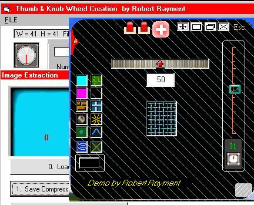



## Knob\-Thumb\-wheels & Skins

### Description

Knob-Thumb-wheels & Skins Demo by Robert Rayment. An earlier version has been deleted. Three programs. The first develops and tests bmp strips from a starting image where, for knob wheels the central rotating part's radius and incremental angle can be set as well as, for thumb wheels, number of repeated images. The second program makes compressed True Color 2D arrays of images and masks using zlib.dll (version 1.1.4.0 from www.winimage.com/zlibdll/). For most efficient inflating zlib needs the original uncompressed size. For pictures the original width and height are needed and this is stored at the beginning of the compressed picture array, from which the uncompressed size can also be calculated. The third program uses zlib.dll to inflate the images from a resource file. This is a headerless form, skin, controls & fonts resizing demo using some standard methods (plus some WAV sounds also in the resource file) - a test bed for trying out things. There are 2 full skins but the demo also stores some bitmaps in image boxes, which then serve as buttons and source for tiled skinning. When compiled all the images are then contained within the exe. See Notes.txt. (exe tested on WinXP Home) Win98 Zip 76 KB.
 
### More Info
 
Just run

             |
---                |---
**Submitted On**   |2003-10-10 06:33:54
**By**             |[Robert Rayment](https://github.com/Planet-Source-Code/PSCIndex/blob/master/ByAuthor/robert-rayment.md)
**Level**          |Intermediate
**User Rating**    |4.0 (16 globes from 4 users)
**Compatibility**  |VB 6\.0
**Category**       |[Graphics](https://github.com/Planet-Source-Code/PSCIndex/blob/master/ByCategory/graphics__1-46.md)
**World**          |[Visual Basic](https://github.com/Planet-Source-Code/PSCIndex/blob/master/ByWorld/visual-basic.md)
**Archive File**   |[Knob\-Thumb16566310102003\.zip](https://github.com/Planet-Source-Code/robert-rayment-knob-thumb-wheels-skins__1-49146/archive/master.zip)

### API Declarations

See code

